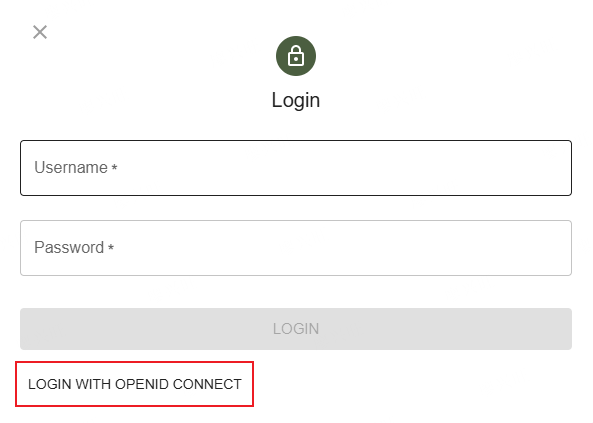

# verdaccio-openid

[](https://www.npmjs.com/package/verdaccio-openid)
[](https://www.npmjs.com/package/verdaccio-openid)
[](https://www.npmjs.com/package/verdaccio-openid)
[](https://www.npmjs.com/package/verdaccio-openid)

English | [中文](README.zh-CN.md)

## About

verdaccio-openid adds OpenID Connect login to Verdaccio for both the web UI and the CLI.

## Compatibility

- Verdaccio 5, 6, 7
- Node >= 20.19.0
- Browsers that support [ES6](https://caniuse.com/?search=es6)

## Install

### Global install

```sh
npm install -g verdaccio-openid
```

### Install into Verdaccio's plugin directory

```bash
mkdir -p ./install-here/
npm install --global-style \
  --bin-links=false --save=false --package-lock=false \
  --omit=dev --omit=optional --omit=peer \
  --prefix ./install-here/ \
  verdaccio-openid@latest
mv ./install-here/node_modules/verdaccio-openid/ /path/to/verdaccio/plugins/
```

## Configuration

Add this to your Verdaccio config:

```yaml
middlewares:
  openid:
    enabled: true

auth:
  openid:
    provider-host: https://example.com
    client-id: CLIENT_ID
    client-secret: CLIENT_SECRET
    username-claim: name
    # scope: openid email groups
    # groups-claim: groups
    # provider-type: gitlab
    # store-type: file
    # store-config: ./store
    # authorized-groups:
    #   - access
    # group-users:
    #   animal:
    #     - tom
    #     - jack
```

### Required options

| Config key      | Description                               |
| --------------- | ----------------------------------------- |
| `provider-host` | The host of the OIDC provider.            |
| `client-id`     | The client ID from the OIDC provider.     |
| `client-secret` | The client secret from the OIDC provider. |

See [Configuration](docs/configuration.md) for the full option list.

## OpenID callback URLs

Configure these in your OIDC provider:

| Flow      | Callback URL                                       |
| --------- | -------------------------------------------------- |
| Web Authn | `https://your-registry.com/-/oauth/callback/authn` |
| Web UI    | `https://your-registry.com/-/oauth/callback`       |
| CLI       | `https://your-registry.com/-/oauth/callback/cli`   |

## Authentication

### Web UI

After setup, clicking the login button sends the user to the OIDC provider.

If `auth.htpasswd.file` is configured, the login dialog shows first with username and password fields, and the OIDC login button appears below it so users can choose either method.



Set `keep-passwd-login` explicitly to override the automatic behavior. See [keep-passwd-login](docs/configuration.md#keep-passwd-login) for details.

### Web Authn (recommended)

```sh
npm login --registry http://your-registry.com
```

This opens a browser window for OIDC login and saves the token automatically.

> Note: npm v9+ uses `--auth-type=web` by default. For npm v8.14 to v8.x, add `--auth-type=web` explicitly. For npm older than v8.14, use the legacy flow:
>
> ```sh
> npm login --auth-type=legacy --registry http://your-registry.com
> ```
>
> See the [npm docs](https://docs.npmjs.com/accessing-npm-using-2fa#sign-in-from-the-command-line-using---auth-typeweb) for details.

### CLI (alternative)

```sh
npx verdaccio-openid@latest --registry http://your-registry.com
```

This uses a local callback server to receive the token. It falls back to this flow when Web Authn is unavailable, such as on older npm versions. See [CLI Authentication](docs/cli-auth.md) for legacy login options.

## Store backends

Choose a backend for session state and cache storage:

| Type                  | Best for                               |
| --------------------- | -------------------------------------- |
| `in-memory` (default) | Single-process development             |
| `redis`               | Multi-replica deployments              |
| `file`                | Single-node persistent storage         |
| `dynamodb`            | Cloud-native multi-replica deployments |
| `mongodb`             | Multi-replica setups with MongoDB      |

See [Store Configuration](docs/store-config.md) for setup instructions and peer dependency requirements.

## Environment variables

Most config values can be set through environment variables, which is useful when you want to keep secrets out of the config file. See [Environment Variables](docs/environment-variables.md) for the naming rules and dotenv support.

## Contributing

See [Development](docs/development.md) for build steps, tests, and project structure.

## Documentation

- [Configuration](docs/configuration.md) — full config reference and provider discovery
- [Store Configuration](docs/store-config.md) — Redis, file, DynamoDB, and MongoDB backends
- [Environment Variables](docs/environment-variables.md) — env var names and dotenv support
- [CLI Authentication](docs/cli-auth.md) — CLI login flow
- [Development](docs/development.md) — build, testing, and project structure

## License

MIT
