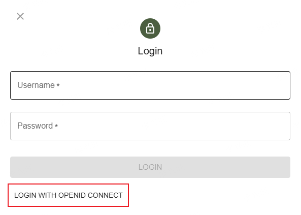

# verdaccio-openid

[](https://www.npmjs.com/package/verdaccio-openid)
[](https://www.npmjs.com/package/verdaccio-openid)
[](https://www.npmjs.com/package/verdaccio-openid)
[](https://www.npmjs.com/package/verdaccio-openid)

[English](README.md) | 中文

## 简介

为 Verdaccio 提供 OIDC OAuth 集成的插件，支持浏览器和命令行两种认证方式。

## 兼容性

- Verdaccio 5、6、7
- Node >= 20
- 支持 [ES6](https://caniuse.com/?search=es6) 的浏览器

## 安装

### 全局安装

```sh
npm install -g verdaccio-openid
```

### 安装到 Verdaccio 插件目录（高级）

```bash
mkdir -p ./install-here/
npm install --global-style \
  --bin-links=false --save=false --package-lock=false \
  --omit=dev --omit=optional --omit=peer \
  --prefix ./install-here/ \
  verdaccio-openid@latest
mv ./install-here/node_modules/verdaccio-openid/ /path/to/verdaccio/plugins/
```

## 配置

将以下内容添加到 Verdaccio 配置文件中：

```yaml
middlewares:
  openid:
    enabled: true

auth:
  openid:
    provider-host: https://example.com
    client-id: CLIENT_ID
    client-secret: CLIENT_SECRET
    username-claim: name
    # scope: openid email groups
    # groups-claim: groups
    # provider-type: gitlab
    # store-type: file
    # store-config: ./store
    # authorized-groups:
    #   - access
    # group-users:
    #   animal:
    #     - tom
    #     - jack
```

### 必填选项

| 配置项          | 说明                      |
| --------------- | ------------------------- |
| `provider-host` | OIDC 提供方的主机地址。   |
| `client-id`     | OIDC 提供方的客户端 ID。  |
| `client-secret` | OIDC 提供方的客户端密钥。 |

查看 [配置](docs/zh-CN/configuration.md) 了解所有可用选项。

## OpenID 回调地址

在 OIDC 提供方中配置以下回调地址：

| 流程      | 回调地址                                           |
| --------- | -------------------------------------------------- |
| Web Authn | `https://your-registry.com/-/oauth/callback/authn` |
| Web UI    | `https://your-registry.com/-/oauth/callback`       |
| CLI       | `https://your-registry.com/-/oauth/callback/cli`   |

## 认证

### Web UI

配置完成后，点击登录按钮即可直接跳转到 OIDC 提供方进行认证。

如果配置了 `auth.htpasswd.file`，登录页面会先显示用户名/密码输入框，OIDC 登录按钮显示在下方，允许用户选择任一方式登录。



显式设置 `keep-passwd-login` 可以覆盖自动检测行为。详见 [keep-passwd-login](docs/zh-CN/configuration.md#keep-passwd-login)。

### Web Authn（推荐）

```sh
npm login --registry http://your-registry.com
```

打开浏览器窗口进行 OIDC 登录，成功后自动保存 token。

> **注意：** npm v9+ 默认使用 `--auth-type=web`。npm v8.14–v8.x 需要显式添加 `--auth-type=web`。npm < v8.14 使用 legacy 方式：
>
> ```sh
> npm login --auth-type=legacy --registry http://your-registry.com
> ```
>
> 详见 [npm 文档](https://docs.npmjs.com/accessing-npm-using-2fa#sign-in-from-the-command-line-using---auth-typeweb)。

### CLI（备选）

```sh
npx verdaccio-openid@latest --registry http://your-registry.com
```

使用本地回调服务器接收 token。当 Web Authn 不可用时（如旧版 npm）可回退到此方式。详见 [CLI 认证](docs/zh-CN/cli-auth.md)。

## 存储后端

为会话状态和缓存选择合适的存储后端：

| 类型                | 适用场景         |
| ------------------- | ---------------- |
| `in-memory`（默认） | 单进程、开发环境 |
| `redis`             | 多副本部署       |
| `file`              | 单节点、持久化   |
| `dynamodb`          | 云原生、多副本   |

详见 [存储配置](docs/zh-CN/store-config.md) 了解各后端的安装说明和所需 peer dependency。

## 环境变量

所有配置项都可以通过环境变量设置，避免将敏感信息写入配置文件。详见 [环境变量](docs/zh-CN/environment-variables.md) 了解命名规则和 dotenv 支持。

## 贡献

详见 [开发指南](docs/zh-CN/development.md) 了解构建、测试和项目结构。

## 文档

- [配置](docs/zh-CN/configuration.md) — 所有配置选项、OIDC 提供方发现
- [存储配置](docs/zh-CN/store-config.md) — Redis、File、DynamoDB 后端及 peer dependency
- [环境变量](docs/zh-CN/environment-variables.md) — 环境变量映射、dotenv 支持
- [CLI 认证](docs/zh-CN/cli-auth.md) — CLI 登录流程
- [开发指南](docs/zh-CN/development.md) — 构建、测试、项目结构

## 许可证

MIT
